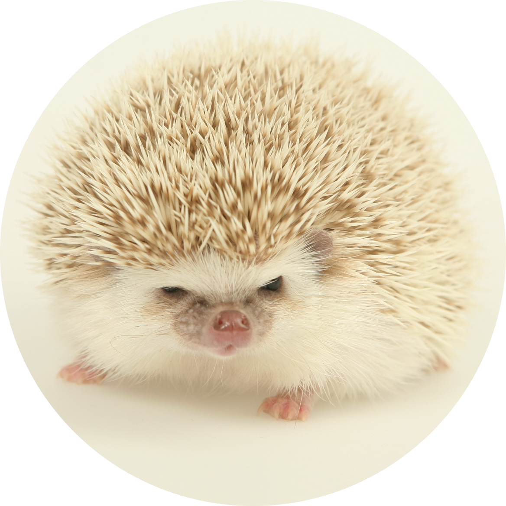

## __Yauheni Basalai__
<br>


__Location: Brest, Belarus__
> *Winter is coming...*

<hr>

## __contacts__

<a href="mailto:drabant2022@gmail.com"></a>
 [](https://discordapp.com/users/959439012798550067/)
 [](https://twitter.com/DrabantBY)
 [](https://github.com/DrabantBY)
 [](https://tlgg.ru/@DrabantBY)

 >*The squeaky wheel gets the grease.* <br>

<hr>

## __about me__

Until August 2020, I worked as a forensic expert. I liked my job, but I had <br> to leave it to find new opportunities.  Alternatively, I decided to take up <br> programming, because there I can show my responsibility, creativity and <br> perseverance. I am sure that the new job will bring a lot of benefit to me <br> and my future company.

>*A cat may look at a king.*

<hr>

## __my skills__ 

&nbsp;<br>
&nbsp;<br>
&nbsp;

>*He works best who knows his trade.* 

<hr>

## __code example__

```javascript
function getPrimesNumbers(num) {
    const numbers = [], primes = [];
    for (let i = 2; i <= num ; i++) {
        if(!numbers[i]) {
            primes.push(i);
            for (let j = i * i; j <= num; j += i) {
                numbers[j] = true;
            }
        }
    }
    return primes;
}
```
>*Don’t judge a book by its cover.*

<hr>

## __experience__
>*Experience is what you get without getting what you wanted.*

<hr>

## __education__

* [Web technologies: entry level](https://stepik.org/cert/1507904)
* [Web development for beginners: HTML and CSS](https://stepik.org/cert/1063742)
* [Web development. Frontend](https://stepik.org/course/100971)
* [Html & CSS Basics](https://stepik.org/cert/1514290)
* [JavaScript for beginners](https://stepik.org/cert/1350525)
* [Hexlet: introduction to programming (JavaScript ES6)](https://stepik.org/course/13929/)
* [Regular expressions. Interactive simulator](https://stepik.org/course/101990)
* [Algorithms: theory and practice. Data structures](https://stepik.org/course/1547)
* [Algorithms: theory and practice. Methods](https://stepik.org/cert/1337122)
* [Easy start in Java. Introductory course](https://stepik.org/course/90684)
* [Java Basics](https://stepik.org/course/82867)
* [Java. Basic course](https://stepik.org/course/187)
* [Java. Functional programming](https://stepik.org/course/91497)
* [Summer Java school](https://stepik.org/course/10498)
* [Development of web applications on Node.js](https://stepik.org/course/100438)

> *First, we teach our children. Then we ourselves learn from them. <br> Whoever does not want to do this is lagging behind his time.*

<hr>

## __languages__
&nbsp;__A2__&nbsp;&nbsp;&nbsp;__B2__&nbsp;&nbsp;&nbsp;
__B2__&nbsp;&nbsp;&nbsp;__A2__


